# Android-to-macOS Continuity Pairing Contract

This document acts as the official contract and protocol specification defining how a macOS client can pair successfully with the Android application. Android is the source of truth for the cryptographic and communication flows defined below.

---

## 1. BLE GATT Service and Characteristics

During the pairing sequence, macOS acts as the **GATT Server** and Android acts as the **GATT Client**. macOS must host a GATT database with the following service and characteristics:

| Element | UUID | Properties | Description |
| :--- | :--- | :--- | :--- |
| **GATT Service** | `4F101A2B-3C4D-5E6F-7A8B-9C0D1E2F3A4B` | — | Core continuity service |
| **Write Characteristic** | `4F101A2C-3C4D-5E6F-7A8B-9C0D1E2F3A4B` | `WRITE` / `WRITE_NO_RESPONSE` | Android writes ephemeral keys and authentication packets here. |
| **Notify Characteristic** | `4F101A2D-3C4D-5E6F-7A8B-9C0D1E2F3A4B` | `NOTIFY` | macOS sends ephemeral keys and authentication responses here. |
| **CCCD Descriptor** | `00002902-0000-1000-8000-00805f9b34fb` | `READ` / `WRITE` | Android writes `[0x01, 0x00]` here to enable notifications on the Notify Characteristic. |

---

## 2. Cryptographic Key Formats

All keys exchanged via QR or BLE are encoded in **Standard Base64 without line wrapping** (`Base64.NO_WRAP` / RFC 4648).

### Ed25519 (Long-Term Identity Keys)
* Used for peer signing and signature verification.
* **Public Key Size:** 32 bytes raw.
* **Base64 Representation:** 44 characters (e.g. `u514c3+fG56...`).
* **Signature Size:** 64 bytes raw (output of standard Ed25519 signature algorithm).

### X25519 (Ephemeral Exchange Keys)
* Used for Diffie-Hellman ephemeral key agreement.
* **Public Key Size:** 32 bytes raw.
* **Base64 Representation:** 44 characters.
* **Shared Secret Derivation:**
  1. Compute the 32-byte X25519 shared secret: `X25519.computeSharedSecret(localPrivateKey, peerPublicKey)`.
  2. Compute SHA-256 of the raw 32-byte shared secret to derive a **32-byte (256-bit) AES session key**:
     $$\text{AES Session Key} = \text{SHA-256}(\text{X25519 Shared Secret})$$

---

## 3. QR Payload Format

macOS displays a QR code containing its connection details. The format is a comma-separated value (CSV) string prefixed with `identity_continuity:`:

```text
identity_continuity:<deviceId>,<name>,<bleMacAddress>,<publicKeyEd25519>,<ephemeralPublicKeyX25519>
```

### Fields:
1. **`deviceId`**: Unique string identifier (e.g., UUID) of the macOS client.
2. **`name`**: Human-readable device name (e.g. `MacBook Pro`).
3. **`bleMacAddress`**: BLE MAC address (formatted as `XX:XX:XX:XX:XX:XX`) used by Android to initiate the direct BLE GATT connection.
4. **`publicKeyEd25519`**: Base64-encoded (NO_WRAP) long-term Ed25519 public key of macOS.
5. **`ephemeralPublicKeyX25519`**: Base64-encoded (NO_WRAP) X25519 ephemeral public key (included in payload, but the live key negotiated over BLE is preferred).

**Example Payload:**
```text
identity_continuity:8a4b2c9d-1e5f-4a3b-9c2d-1e5f3a4b6c7d,MacBook Pro,AA:BB:CC:DD:EE:FF,dGVzdF9wdWJsaWNfa2V5X2VkMjU1MTlfdmFsdWU=,dGVzdF9wdWJsaWNfa2V5X3gyNTUxOV92YWx1ZQ==
```

---

## 4. Pairing Protocol Sequence

The following diagram illustrates the exact packet-level sequence. Both parties must execute this sequence in order, using UTF-8 text representation for BLE payloads.

```mermaid
sequenceDiagram
    autonumber
    actor macOS as macOS (GATT Server)
    actor Android as Android (GATT Client)

    Note over macOS: Displays QR Code on Screen
    Android->>macOS: Scans QR code & retrieves BLE MAC address, Name, and Ed25519 PubKey
    Android->>macOS: Connects via BLE to GATT Server MAC Address
    Android->>macOS: Discovers Service & Characteristics
    Android->>macOS: Writes [0x01, 0x00] to Notify Characteristic CCCD Descriptor (0x2902)
    Note over Android,macOS: --- Ephemeral Key Agreement (ECDH) ---
    Android->>macOS: Writes Android Ephemeral X25519 PubKey (Base64 String) to Write Characteristic
    macOS->>Android: Notifies macOS Ephemeral X25519 PubKey (Base64 String) via Notify Characteristic
    Note over Android: Computes SHA-256(ECDH Shared Secret) -> Session Key
    Note over macOS: Computes SHA-256(ECDH Shared Secret) -> Session Key
    Note over Android,macOS: --- Peer Authentication ---
    Android->>macOS: Writes Auth Challenge to Write Characteristic
    Note over macOS: Verifies Android Signature & Challenge
    macOS->>Android: Notifies Auth Response via Notify Characteristic
    Note over Android: Verifies macOS Signature & Challenge
    Note over Android,macOS: --- Pairing Complete (Persisted to Database) ---
```



### Packet Specifications:

#### Packet A: Android Ephemeral Key Transmission
* **Transmission:** Android writes to `WRITE_CHAR_UUID`.
* **Payload Format:** `String` (UTF-8 bytes of Base64 X25519 Public Key).
* **Example:** `bm9ud3JhcGJhc2U2NA==...`

#### Packet B: macOS Ephemeral Key Transmission
* **Transmission:** macOS notifies `NOTIFY_CHAR_UUID`.
* **Payload Format:** `String` (UTF-8 bytes of Base64 X25519 Public Key).
* **Example:** `Y29udGludWl0eWJhc2U2NA==...`

#### Packet C: Android Authentication Challenge (`auth:`)
* **Transmission:** Android writes to `WRITE_CHAR_UUID`.
* **Payload Format:** Colon-separated string:
  ```text
  auth:<androidChallengeBase64>:<androidSignatureBase64>:<androidPublicKeyEd25519>
  ```
  * `androidChallengeBase64`: Base64 string of a random 16-byte challenge array.
  * `androidSignatureBase64`: Base64 string of the Ed25519 signature of `androidChallenge` bytes using Android's long-term private key.
  * `androidPublicKeyEd25519`: Base64 string of Android's long-term Ed25519 public key.
* **Example:** `auth:c2FtcGxlY2hhbGxlbmdl:c2FtcGxlc2lnbmF0dXJl:c2FtcGxlcHVibGlja2V5`

#### Packet D: macOS Authentication Response (`auth_resp:`)
* **Transmission:** macOS notifies `NOTIFY_CHAR_UUID`.
* **Payload Format:** Colon-separated string:
  ```text
  auth_resp:<macChallengeBase64>:<macSignatureBase64>
  ```
  * `macChallengeBase64`: Base64 string of a random 16-byte challenge array generated by macOS.
  * `macSignatureBase64`: Base64 string of the Ed25519 signature of `macChallenge` bytes using macOS's long-term private key.
* **Example:** `auth_resp:bWFjY2hhbGxlbmdl:bWFjc2lnbmF0dXJl`

---

## 5. Trusted Device Schema

When pairing completes successfully, both devices persist their peer's profile details. The Android application stores the macOS device details in its Room SQLite database under the table `trusted_devices`:

```sql
CREATE TABLE IF NOT EXISTS `trusted_devices` (
    `deviceId` TEXT NOT NULL,                   -- Unique macOS Device ID (UUID)
    `name` TEXT NOT NULL,                       -- Human-readable device name
    `bleMacAddress` TEXT NOT NULL,               -- BLE MAC Address used for automatic reconnection
    `lastKnownIpAddress` TEXT,                  -- Optional IP Address for Wi-Fi socket communication
    `publicKeyEd25519` TEXT NOT NULL,           -- Base64-encoded macOS identity public key
    `isTrustActive` INTEGER NOT NULL,           -- 1 for Trusted, 0 for Revoked
    `pairingTimestamp` INTEGER NOT NULL,        -- Epoch milliseconds of pairing execution
    `lastSeenTimestamp` INTEGER NOT NULL,       -- Epoch milliseconds of last communication
    PRIMARY KEY(`deviceId`)
);
```

macOS should implement a matching secure local store (e.g. Core Data/Keychain) containing the corresponding Android attributes:
* Android `deviceId` (UUID)
* Android `name`
* Android `publicKeyEd25519`
* Pairing timestamps and communication states
