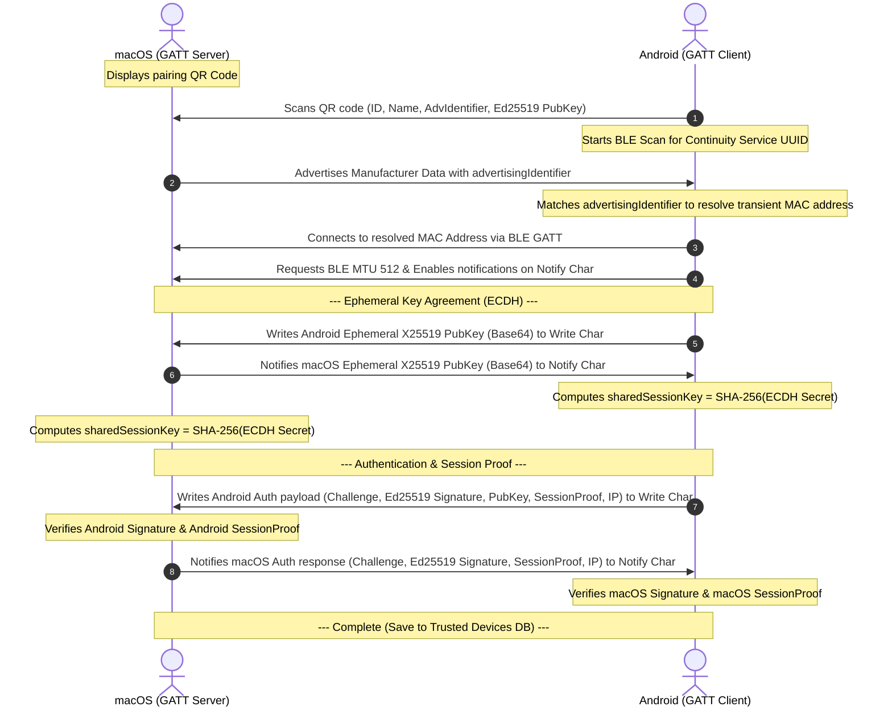

# Updated Continuity Pairing Protocol (Android & macOS)

This document defines the pairing protocol flow between Android and macOS, removing physical BLE MAC address dependencies and ephemeral keys from the QR code, while introducing session proof verification and future Wi-Fi IP address exchange.

---

## 1. Overview of Protocol Flow

The protocol consists of three consecutive phases executed when the user initiates pairing:

1. **QR Scanning & BLE Discovery:** macOS displays connection info. Android scans it, starts BLE discovery, filters for matching service advertising identifier (transient MAC address resolution), and establishes a connection.
2. **X25519 DH Key Agreement:** Devices exchange X25519 ephemeral public keys over BLE and derive the `sharedSessionKey` using SHA-256 of the shared secret.
3. **Challenge-Response & Session Proof Verification:** Devices generate challenges, verify signatures using the long-term Ed25519 keys, and exchange session proofs (HMAC-SHA256) along with their local IP addresses.



---

## 2. Authentication Packet Structure & Fields

All key exchanges and signature payloads use standard Base64 encoding without wrapping (`Base64.NO_WRAP`). Payloads are sent as UTF-8 string bytes.

### Android Authentication Packet (Write Characteristic)
Android writes this colon-separated string payload to the Write Characteristic:

```text
auth:<androidChallengeBase64>:<androidSignatureBase64>:<androidPublicKeyEd25519>:<androidSessionProofBase64>:<androidIpAddress>
```

* **`androidChallengeBase64`:** Random 16-byte challenge generated by Android, Base64-encoded.
* **`androidSignatureBase64`:** Ed25519 signature of the raw 16-byte `androidChallenge` using Android's long-term private key, Base64-encoded.
* **`androidPublicKeyEd25519`:** Base64-encoded Android long-term Ed25519 public key.
* **`androidSessionProofBase64`:** HMAC-SHA256 session proof verifying ownership of the session key, Base64-encoded:
  $$\text{androidSessionProof} = \text{HMAC-SHA256}(\text{sharedSessionKey}, \text{androidChallenge})$$
* **`androidIpAddress`:** Active Wi-Fi IPv4 address of Android (e.g. `192.168.1.100`), or `0.0.0.0` if offline.

### macOS Authentication Response Packet (Notify Characteristic)
macOS notifies Android with this colon-separated string payload on the Notify Characteristic:

```text
auth_resp:<macChallengeBase64>:<macSignatureBase64>:<macSessionProofBase64>:<macIpAddress>
```

* **`macChallengeBase64`:** Random 16-byte challenge generated by macOS, Base64-encoded.
* **`macSignatureBase64`:** Ed25519 signature of the raw 16-byte `macChallenge` using macOS's long-term private key, Base64-encoded.
* **`macSessionProofBase64`:** HMAC-SHA256 session proof verifying macOS ownership of the session key, Base64-encoded:
  $$\text{macSessionProof} = \text{HMAC-SHA256}(\text{sharedSessionKey}, \text{macChallenge})$$
* **`macIpAddress`:** Active Wi-Fi IPv4 address of macOS, or `0.0.0.0`/`unknown` if offline.

---

## 3. Cryptographic Verification Requirements

When verifying incoming authentication packets, both clients must enforce:
1. **Signature Verification:** Verify that the signature resolves correctly against the challenge using the long-term Ed25519 public key (the Android public key for macOS; the macOS public key parsed from the QR code for Android).
2. **Session Key Proof:** Independently compute the expected proof:
   $$\text{Expected Proof} = \text{HMAC-SHA256}(\text{sharedSessionKey}, \text{Challenge})$$
   Ensure that the received Base64-decoded proof matches the expected proof. If they do not match, pairing must be rejected immediately, preventing MITM key injection attacks.
3. **Database Entry:** Upon validation, both clients save the device name, UUID (`deviceId`), transient BLE MAC address, public key, and IP address to their trusted device list.
